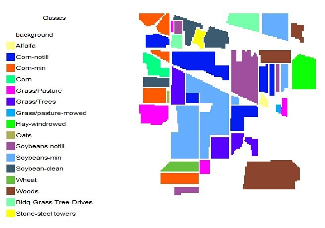

# Comparison of Feature Reduction Techniques for Hyperspectral Image Classification
### Author 
Md. Zobair Hussain  
Roll No. 143014  
Department of Computer Science & Engineering 
Rajshahi University of Engineering & Technology 
 
### Supervised by 
Rizoan Toufiq 
Assistant Professor 
Department of Computer Science & Engineering 
Rajshahi University of Engineering & Technology 

### ABSTRACT
Hyperspectral image has provided significant opportunities for material identification and classification because of its ability to contain rich information. The processing of hyperspectral image is a challenging task because of its high dimensionality and data redundancy. Classification technique such as Support Vector Machine can be applied to classify high dimensional data. Before applying SVM the data needs to be pre-processed to improve classification accuracy since high dimensional data suffers from Hughes Phenomenon. Dimension can be reduced by using feature selection and feature extraction approaches. Many supervised and unsupervised feature selection and feature extraction methods are present. In this paper, three supervised approaches are compared for the reduction of high dimensionality problem. Principal Component Analysis (PCA) and Linear Discriminant Analysis are the feature extraction methods and minimum Redundancy Maximum Relevance (mRMR) is the feature selection method used in our study. Furthermore, we combined PCA and mRMR for the purpose of feature reduction and this approach achieved 91.16% classification accuracy on real hyperspectral data. 

### Dataset
The Indian Pines Dataset is obtained by AVIRIS sensor over the Indian Pines test site in North-western Indiana and consists of 145 * 145 pixels and 224 spectral reflectance bands in the wavelength range 0.4–2.5 μm. 

### Work Flow
The steps of the proposed methods are:
1. Perform PCA to extract features from the input dataset.
2. Perform LDA to extract features from the input dataset.
3. Apply mRMR on the Original dataset.
4. Apply mRMR on the PCA dataset.
5. Select the best features based on the mRMR applied PCA dataset.
6. Apply Support Vector Machine (SVM) to find classification accuracy.

### Classification Accuracy 
PCA =	86.78% 
LDA =	87.53% 
mRMR =	81.34% 
PCA+mRMR =	92.16% 

